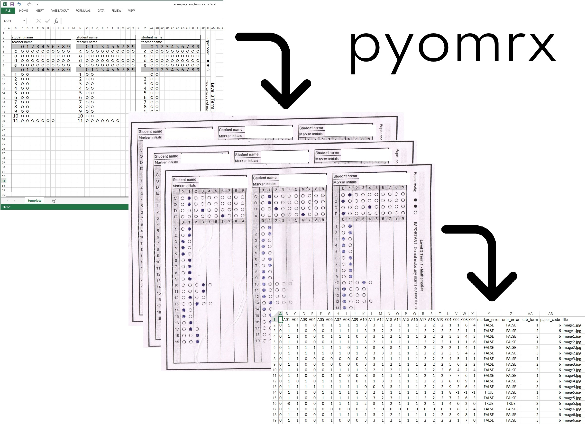
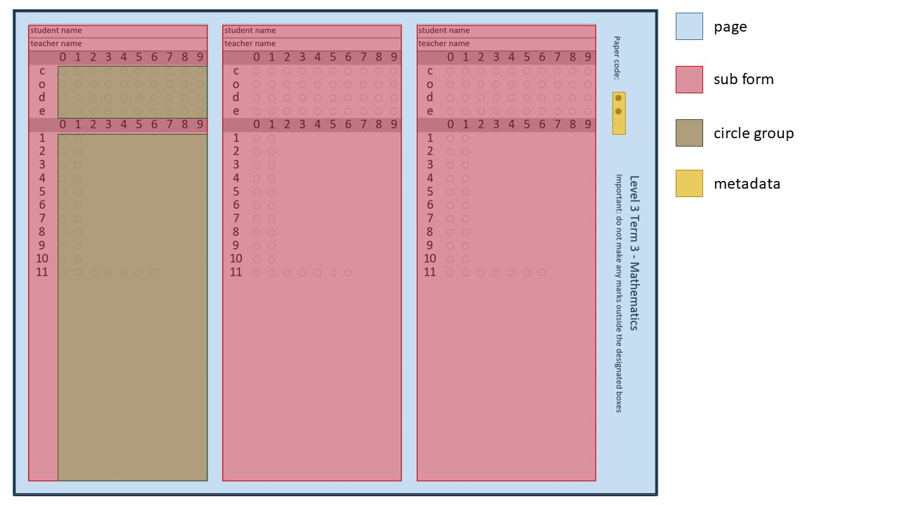
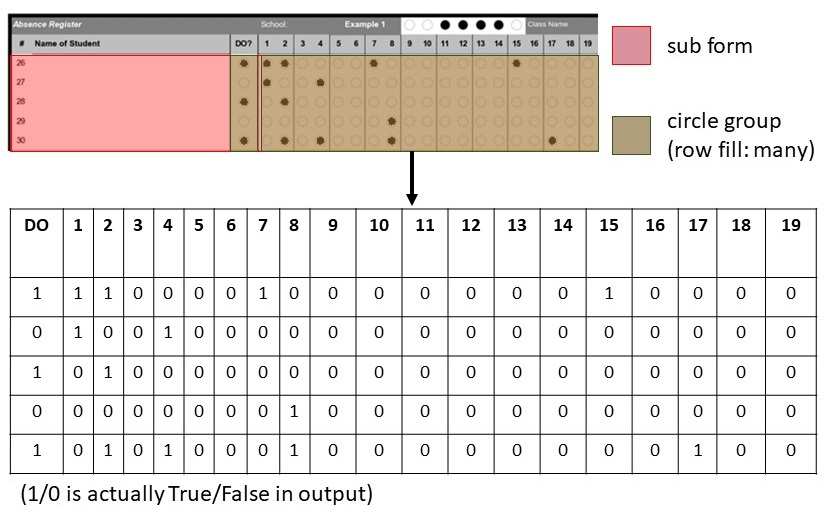
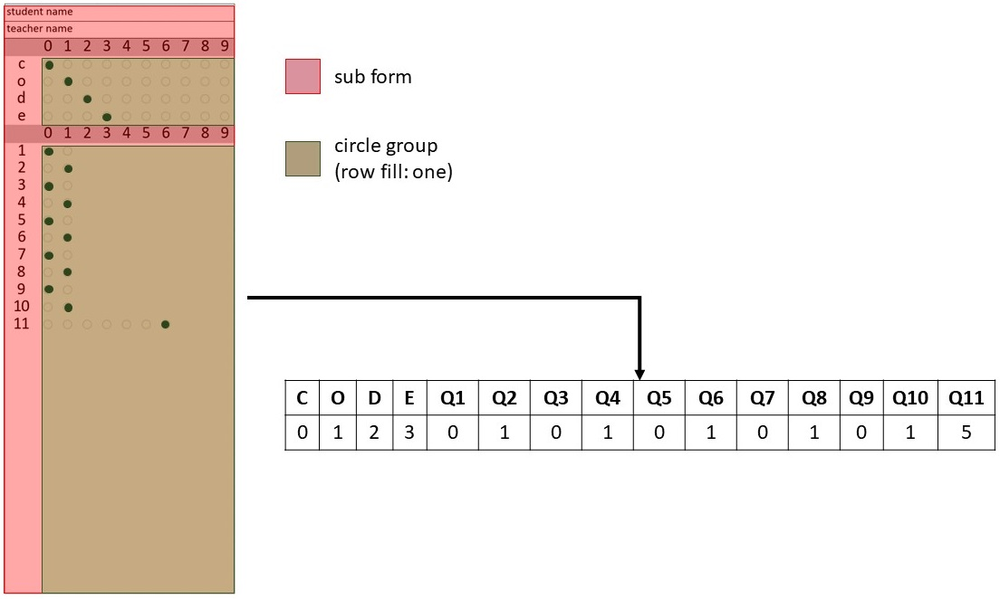

------


Python Optical Mark Recognition eXtraction tool is a library and GUI for generating OMR forms and extracting data from them. 
Form design is done in excel, then the tool converts this into an image and a .omr file. 
The image is printed, completed and scanned, then the tool extracts data from a batch of scans and outputs a csv file. 
Made originally for the education team at Save the Children UK for capturing school attendance and exam score data in 
contexts where digital data collection isn't possible.

# Install
To just use the graphical user interface on windows, click on releases above and download the latest version as a zip file, extract it, and use run.exe to start the tool.
To use as a python package:

`pip install pyomrx`

To build the windows executable, from the repo root run `python build_exe_zip.py`, which uses cx_Freeze to bundle requirements.

# Quickstart
The examples folder contains an attendance form and and exam marksheet folder. 
This quickstart will guide you through the full process of making and extracting from a form via the GUI. There is also a CLI, described below.
To run the examples with the GUI follow these steps:
1. Start the GUI (either `python app.py` or if you downloaded a release, unzip the build folder and rouble click `run.exe`)
2. Click the `Generate template` tab
3. Choose the excel file in one of the example folders as the template file, and choose an output file path for the `.omr` file. 
4. Click `Process` and wait for completion
5. Open the output location you chose: there should be an image (or 2 in the attendance form case) and a .omr file
6. Fill in one of the images: either print, complete and scan (as an image not a pdf), or use the fill tool in paint. See the form filling guide below.
7. Put the image in a new folder
8. Start the GUI again, this time click the `Extract data` tab
9. Choose the previously generated `.omr` template file, select the new images folder, and choose an output path
10. Click `Process` and wait for completion. Your extracted data should now be ready as a csv file.

# Parts of an OMR form
A pyomrx form contains the following heirarchy of components:


| Component     | Named range format  | Example       |
|---------------|---------------------|---------------|
| Page          | page_\<number\>     | page_1        |
| Sub form      | sub_form_\<number\> | sub_form_1    |
| Circles group | circles_\<name\>    | circles_score |
| Metadata      | meta_\<name\>       | meta_school   |

The heirarchy of form components is as follows:
- page > sub form > circle group
- page > metadata

Note:
- These components are defined through excel's
 [named ranges](https://support.office.com/en-gb/article/define-and-use-names-in-formulas-4d0f13ac-53b7-422e-afd2-abd7ff379c64)
- page_1 always serves as the template for other pages
- sub_form_1 always serves as the template for other sub forms
- circle groups can either be intended to have 1 circle per row filled, or many. This is explained further below.

# Creating a form in excel
Start by checking out the excel files in the examples folder.
Especially, look at the named ranges and their comments in the Name Manager.
There's a good chance you could adapt these forms to your purpose rather than starting from scratch.

The overall process if you do start from scratch is as follows:
1. Define one or more named ranges to be separate pages of the OMR form (with identical dimensions)
2. Define one or more sub forms within the page_1 named range (with identical dimensions)
3. Define one or more metadata circle groups within the page_1 range but outside all sub forms 
4. Define one or more circle groups within the sub_from_1 named range
5. Use the 'comments' feature of the name manager to configure each circle group as follows:
row fill: <many|one>, column prefix: <string>, index name: <string>

Notes:
- All child components must be completely contained within the parent
- Metadata circle groups must be outside all sub forms
- All form components must be on a worksheet named 'template'
- Dates are not supported: store them as text or numbers  
- All 'pages' in one excel file must be exactly the same dimensions
- All sub forms must be exactly the same dimensions
- Circles within circle groups and metadata circle groups (where marks will be recognised)
 must use the characters ○ (U+25CB) and ● (U+25CF) to denote empty and filled circles respectively. 


Currently the following arrangements of circle groups are supported:
circle group (row fill: many) left-right of circle group (row fill: many)


circle group (row fill: one) above-below circle group (row fill: one)



# CLI
`python pyomrx_cli.py [-h] [-i INPUT] [-o OUTPUT] [-t TEMPLATE] [make|extract]`
(template only needed to extract data)

# Completing a printed pyomrx form for best results
For best results ensure the following:
- Within circle group areas, do not mark the form other than to fill circles
- Scan the form with the highest quality possible: the whole image needs to be clear, well lit, and high resolution 
- The form's thick outer rectangle must be unbroken and without extra marks over or near it
- Avoid folding the form as creases are visible and affect the data extraction
- Use black ink to fill circles

# Example output
The following is an example output of an exam marksheet form:
```
,sub_form,omr_error,marker_error,C01,C02,C03,C04,A01,A02,A03,A04,A05,A06,A07,A08,A09,A10,A11,A12,A13,A14,A15,paper_code,file
0,1,FALSE,FALSE,2,0,4,7,2,2,2,2,2,2,2,2,2,3,3,1,1,1,3,4,ziml2lang (4).jpg
0,2,FALSE,FALSE,2,1,2,4,1,1,1,2,2,2,2,2,2,2,3,1,1,1,2,4,ziml2lang (4).jpg
0,3,FALSE,FALSE,2,1,2,8,2,1,1,1,1,2,2,2,2,2,2,0,0,1,2,4,ziml2lang (4).jpg
0,1,FALSE,FALSE,2,1,3,1,2,2,2,2,2,2,2,2,2,3,3,1,1,1,4,4,ziml2lang (5).jpg
0,2,FALSE,FALSE,2,0,1,7,2,2,2,2,2,2,2,2,2,3,3,1,1,1,4,4,ziml2lang (5).jpg
0,3,FALSE,FALSE,2,0,6,0,2,2,2,2,2,2,2,2,2,3,3,1,1,1,3,4,ziml2lang (5).jpg
```

# Troubleshooting
As well as the rest of this readme, check the following things:
1. File path too long: this is a limitation on Windows. Try moving all relevant files to the desktop with short names.

(If you have an issue or notice something else which you think should be here, please let us know)


# Tests
`pytest`

# Contributing
Contributions are welcome,  whether submitting an issue with a question, an idea, or a problem you've noticed, 
or submitting a pull request.
For pull requests, please first discuss the change you wish to make via issue, email,
 or any other method with the owners of this repository before making a change.
Please ensure the following before opening a pull request:
- Please format your code using yapf, (version in requirements.txt) 
- New features should be accompanied with tests
- Update this README.md file where relevant
- Increase the version numbers in pyomrx/\__init\__.py to the new version that this Pull Request would represent. 
The versioning scheme we use is [SemVer](http://semver.org/).

- Ensure the executable builds and works correctly. This is currently a manual check.

# Credits
This repository was created and is maintained by Shaun Howell (shaunkhowell -at- gmail.com).
Big thank you to the education team at Save the Children UK, with whom this tool was originally conceived and created,
 especially Kathryn Cooper and Patrick Mroz-Dawes.
 
# License 
This software is distributed under a permissive MIT license, as specified in LICENSE.txt 
